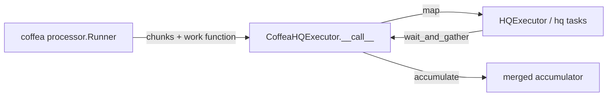

# CoffeaHQExecutor: running coffea on hq

`CoffeaHQExecutor` ([`src/hq/coffea.py`](../../src/hq/coffea.py)) makes hq a
drop-in executor for `coffea.processor.Runner`, alongside coffea's own
`FuturesExecutor` and `DaskExecutor`.

## How it plugs in

It is a `@dataclass` subclass of coffea's `ExecutorBase`, composed **over**
`HQExecutor` (not inheriting from it). Coffea calls it as
`executor(items, function, accumulator)`; each call:

1. registers any `pickle_modules` by value with cloudpickle,
2. opens an `HQExecutor` context (spawns managed workers unless
   `manage_workers=False`),
3. `map`s `function` over the work items — one hq task per coffea chunk,
4. `wait_and_gather`s all task results,
5. merges them with `coffea.processor.accumulate` into the accumulator.



`Runner` invokes the executor twice per job: once for **preprocessing**
(reading file metadata) and once for **processing** (running your
`ProcessorABC` over chunks). Both phases become hq tasks.

`compression=None` overrides coffea's default LZ4 wrapping of results — hq
already moves results as cloudpickle files on the shared filesystem, so
double-wrapping only costs CPU.

## Shipping analysis code: `pickle_modules`

Workers run in a fresh interpreter with only `hq` bootstrapped onto the path
(see [worker.md](worker.md)). Your analysis code gets to the worker **inside
the pickle**, using cloudpickle's `register_pickle_by_value` — the same
pattern the AGC notebooks use for Dask.

Pass every notebook-local module the processor touches:

```python
import utils, ttbar_processor

executor = CoffeaHQExecutor(
    host="https://localhost", port=3000, verify="cert.pem",
    n_workers=8,
    pickle_modules=(utils, ttbar_processor),
)
```

**The failure mode when you forget one is distinctive:** preprocessing
succeeds (it only uses coffea's built-in work function), then every processing
task errors in well under a millisecond with
`ModuleNotFoundError: No module named 'ttbar_processor'` — the unpickle fails
before any file I/O starts. Fix: add the module to `pickle_modules` (and
`register_pickle_by_value` if you pickle anything outside the executor).

Limits of by-value shipping ([ADR 0005](../adr/0005-cloudpickle-by-value.md)):
it ships *your* modules' code, not their dependencies. Workers still need
coffea, awkward, uproot, etc. installed — use the same environment (e.g. the
same conda env) for client and workers.

## Knobs and sizing

| Knob | Default | Guidance |
|------|---------|----------|
| `n_workers` | 2 | ≈ physical cores of the worker machine for CPU-bound coffea work; slight oversubscription (cores + 2–4) can help when chunks wait on remote I/O (xrootd) |
| `Runner(chunksize=...)` | — | one hq task per chunk; larger chunks = fewer tasks = less per-task overhead, but less parallelism and more memory per task |
| `Runner(maxchunks=N)` | unlimited | smoke-test knob: process only the first N chunks per file — use `maxchunks=1` for bring-up, remove for real runs |
| `poll_interval` | 3.0 s | client status-poll frequency; 1.0 is fine locally |
| `manage_workers` | True | set `False` when workers are submitted externally (HTCondor) — then pin `queue=` and share `HQ_RESULT_DIR` |
| `status` | — | progress printing on the client |

Per-task overhead (fetch, subprocess spawn, pickle round-trip, result file) is
fixed per chunk, so it dominates tiny jobs and vanishes on real ones. Measured
on the AGC ttbar analysis (8-core machine, 9 samples, 1 file each):

- tiny job (`maxchunks=1`, 2 workers): hq ≈ 1.1× slower than `FuturesExecutor`
- full job (50 chunks, 8 workers each): hq ≈ 153 s vs Futures ≈ 180 s at
  `workers=4` — and near-identical (~136 s both) once Futures also got 8
  workers

i.e. with equal parallelism the wall time is dominated by I/O and processing,
not by the executor.

## Requirements checklist

- Redis + Bun server running (see [deployment](../ops/deployment.md))
- `HQ_RESULT_DIR` set (or default `/tmp/hq-results`) and shared between client
  and workers
- Worker environment has coffea + analysis dependencies (same env as the
  client is simplest)
- All notebook-local modules in `pickle_modules`

## Working examples

- [`example/agc_hq_vs_futures.py`](../../example/agc_hq_vs_futures.py) —
  AGC ttbar subset, Futures vs hq, asserts histograms match
- [`example/ttbar_analysis_pipeline.ipynb`](../../example/ttbar_analysis_pipeline.ipynb) —
  full AGC notebook wired for hq (`USE_HQ=True`)
- [`example/ttbar_analysis_pipeline_futures.ipynb`](../../example/ttbar_analysis_pipeline_futures.ipynb) —
  the FuturesExecutor reference copy
- [`example/coffea_hq_runner_smoke.py`](../../example/coffea_hq_runner_smoke.py) —
  minimal `Runner` smoke (CountEvents, one file)

## Related

- [Worker internals](worker.md) — why fresh interpreters need shipped code
- [Results](results.md) — how accumulators come back
- [ADR 0005](../adr/0005-cloudpickle-by-value.md)
- [Troubleshooting](../ops/troubleshooting.md) — instant-error tasks and friends
