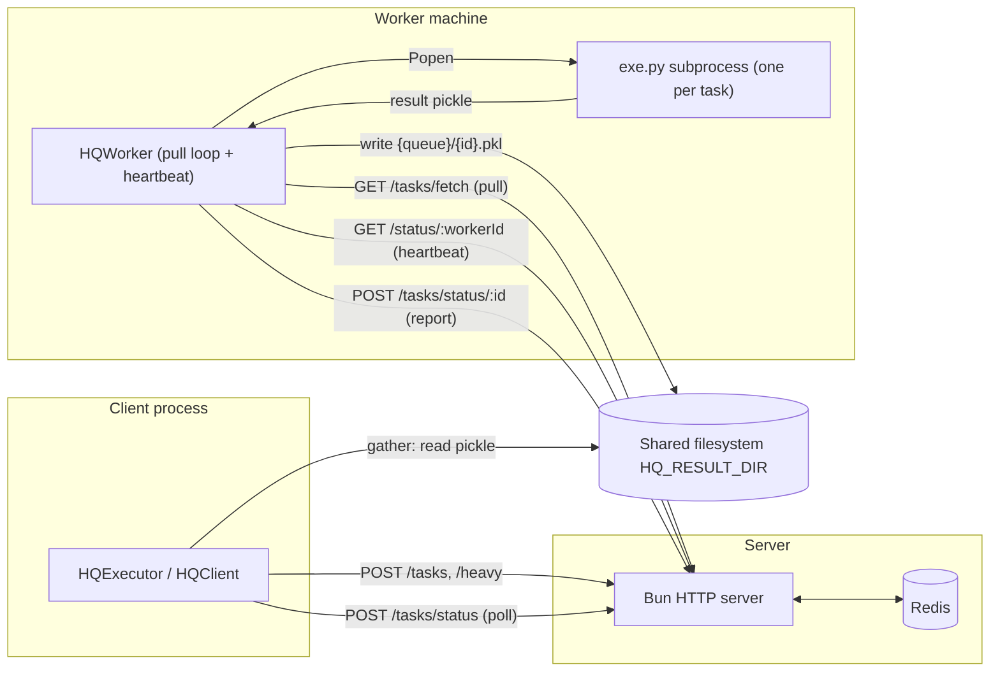

# Architecture overview

hq is a **pull-based task queue** for distributing Python work (in particular
coffea/HEP analysis chunks) across worker processes and machines.

Redis stores the work. A Bun HTTP server is a thin facade over Redis. Python
clients submit pickled callables; Python workers fetch and run them. Nothing
ever pushes tasks onto a worker — workers ask for work when they are ready.

## The three long-lived pieces

| Piece | Role |
|-------|------|
| **Redis** | Source of truth: per-queue FIFO lists, task hashes, shared "heavy" payloads, worker heartbeats |
| **Bun server** ([`typescript/server.ts`](../../typescript/server.ts)) | HTTP API over Redis; the only network boundary (TLS optional) |
| **Python processes** | `HQClient`/`HQExecutor` submit work and poll status; `HQWorker` processes pull and execute tasks |

Two invariants keep the design simple:

- **Workers and clients never talk to Redis directly.** Everything goes through
  the Bun server's HTTP API, so there is exactly one boundary to secure (TLS)
  and Redis is never exposed to the network. See
  [ADR 0002](../adr/0002-http-facade-over-redis.md).
- **The server does not track a worker pool and does not push tasks.** It only
  answers pulls and records heartbeats. See
  [ADR 0001](../adr/0001-pull-based-workers.md).

## System diagram

Task **status** flows through the server; task **results** flow through a
shared filesystem (`HQ_RESULT_DIR`) so large blobs never sit in Redis or on the
HTTP wire. See [results.md](results.md) and
[ADR 0004](../adr/0004-results-on-shared-fs.md).

## Redis key model

| Key | Type | Meaning |
|-----|------|---------|
| `taskId` | string (counter) | Global auto-increment task ID (`INCR` on submit) |
| `tasks:queue:{name}` | list | FIFO of queued task IDs for one queue (`LPUSH` on submit, `RPOP` on fetch) |
| `tasks:{id}` | hash | One task: `taskBuf`, `name`, `heavyKey`, `queue`, `status`, `worker`, `info` |
| `heavy:{key}` | hash | Shared map function: `buf` + `refCount` (see [task-lifecycle.md](task-lifecycle.md)) |
| `workers:health` | hash | `workerId -> last heartbeat timestamp (ms)` |
| `workers:running:{workerId}` | set | Task IDs currently claimed by that worker (used for lost-task recovery) |

## HTTP endpoints

Implemented in [`typescript/routes/`](../../typescript/routes/):

| Endpoint | Method | Caller | Purpose |
|----------|--------|--------|---------|
| `/status` | GET | anyone | Liveness ping (`OK`) |
| `/status/:workerId` | GET | worker | Heartbeat; server records `Date.now()` in `workers:health` |
| `/tasks` | POST | client | Batch-submit tasks (`[{task, name, queue, heavyKey}]` → `{taskIds}`) |
| `/heavy` | POST | client | Store a shared map callable once under `heavyKey` |
| `/tasks/fetch/:workerId/:queue/:n` | GET | worker | Pull up to `n` tasks; server marks them `running` and attaches them to the worker |
| `/tasks/status` | POST | client | Batch status query (`{taskIds}` → statuses + info) |
| `/tasks/status/:taskId` | POST | worker | Report terminal status (`success`/`error`); server validates ownership and state |

## Queues and isolation

A queue is just a name string. Same name → same Redis list; different name →
fully isolated stream of work. `HQExecutor` generates a fresh UUID queue name
per run (see `generate_queue_name` in [`src/hq/util.py`](../../src/hq/util.py)),
so concurrent runs on a shared server never steal each other's tasks. Pin
`queue=` explicitly when workers are started separately from the client (e.g.
HTCondor) and both sides must agree on the name.

## Layered Python API

| Layer | Class | What it adds |
|-------|-------|--------------|
| Connection | `HQBaseConnection` ([`src/hq/base.py`](../../src/hq/base.py)) | `url`, `ping()`, TLS `verify` handling |
| Client | `HQClient` ([`src/hq/client.py`](../../src/hq/client.py)) | `submit`, `map`, `check`, `gather` |
| Worker | `HQWorker` ([`src/hq/worker/worker.py`](../../src/hq/worker/worker.py)) | fetch + heartbeat loops, task subprocesses |
| Orchestration | `HQExecutor` ([`src/hq/executor.py`](../../src/hq/executor.py)) | one `with` block: queue name, local workers, `wait`, `wait_and_gather` |
| coffea | `CoffeaHQExecutor` ([`src/hq/coffea.py`](../../src/hq/coffea.py)) | plugs into `coffea.processor.Runner` (see [coffea-executor.md](coffea-executor.md)) |

## Related

- [Task lifecycle](task-lifecycle.md) — states, sequence diagram, fault recovery
- [Worker internals](worker.md) — pull loop, subprocess execution, IPC
- [Results](results.md) — shared-FS result transport
- [Deployment guide](../ops/deployment.md) — standing all of this up
