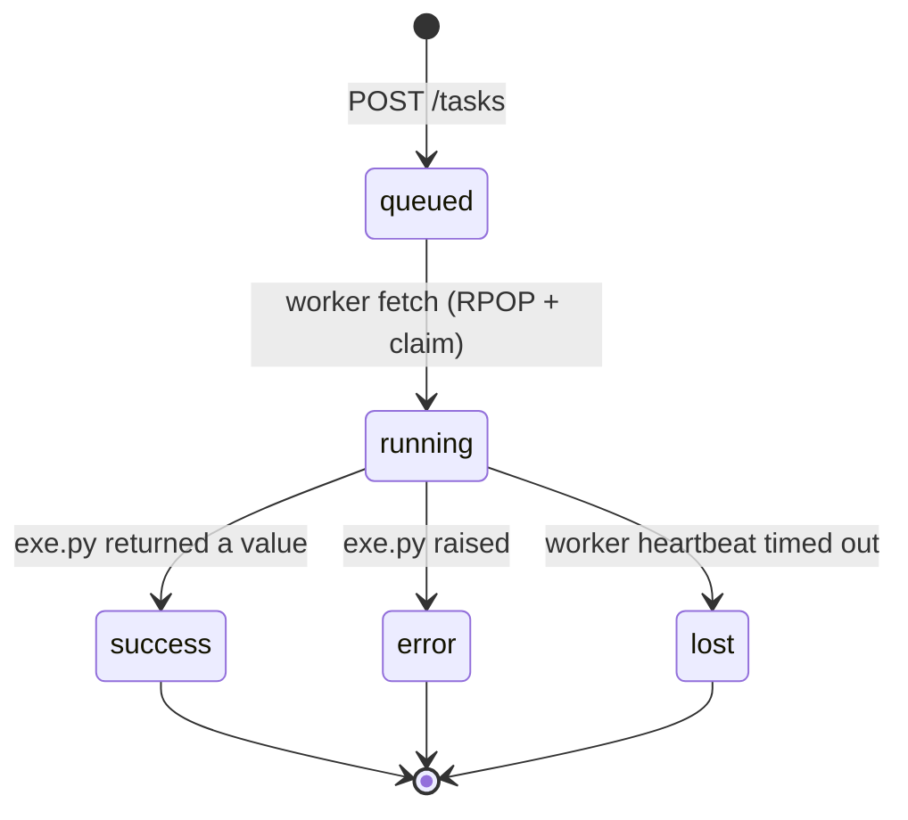
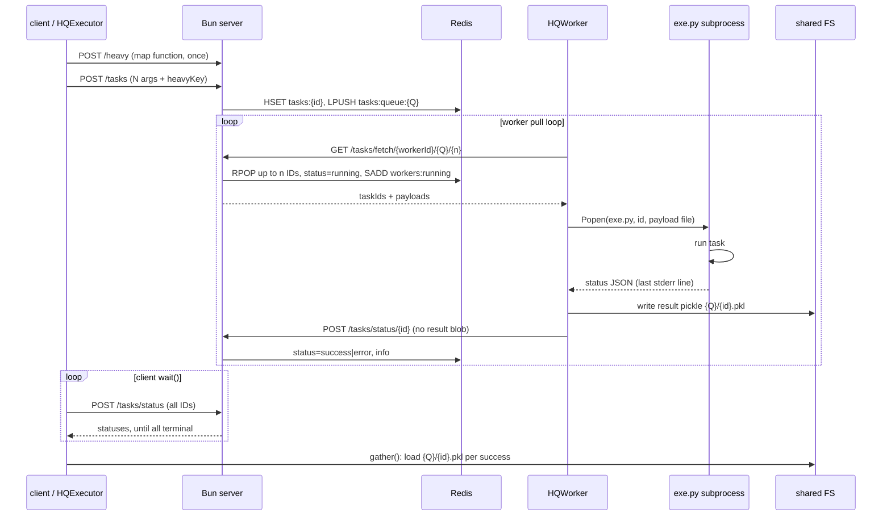

# Task lifecycle

How one task travels from `submit()`/`map()` to a result the client can load.

## States



The server enforces the transitions
([`typescript/routes/tasks.ts`](../../typescript/routes/tasks.ts)):

- Only `running` tasks can move to a terminal status.
- Only the worker that claimed the task (`tasks:{id}.worker`) may report it.
- `queued`/`running` are never reported by workers; `lost` is set only by the
  server's health sweep (below).

Terminal statuses are `success`, `error`, and `lost` — the client's `wait()`
returns once every task is terminal (or unknown).

## Wire format

A task payload is always a 2-element list of base64-encoded cloudpickle
buffers:

```text
[taskBuf, heavyBuf | null]
```

- `[callable, null]` — from `submit(fun)`: the task is a 0-arg callable.
- `[arg, callable]` — from `map(fun, args)`: the heavy buffer is the shared
  1-arg callable and the task buffer is its argument.

`exe.py` reconstructs `functools.partial(heavy, task)` in the second case.

## `submit` vs `map`: heavy payload deduplication

`submit(fun)` sends one pickled callable per task. `map(fun, args)` would
otherwise ship the same (potentially multi-MB) function once per argument, so
it splits the payload ([`src/hq/client.py`](../../src/hq/client.py)):

1. `fun` is pickled once and posted to `/heavy` under the key
   `mapfun:{sha256(pickle)}` — content-addressed, so re-mapping the identical
   function reuses the stored blob.
2. Each argument becomes its own task with `heavyKey` pointing at that blob.
3. The server keeps a `refCount` on `heavy:{key}`: incremented per submitted
   task, atomically decremented (`HINCRBY`) each time a worker claims one.
   When it reaches 0 the blob is deleted from Redis.

## End-to-end sequence



In parallel, every worker heartbeats `GET /status/{workerId}` once per second.

## Fault path: lost tasks

The server runs a periodic sweep
([`typescript/callbacks.ts`](../../typescript/callbacks.ts)) every
`HQ_WORKER_TIMEOUT` ms (default 30 000):

1. For each worker in `workers:health`, compare `now - lastPing` against the
   timeout.
2. If a worker is overdue, every task in `workers:running:{workerId}` that is
   still `running` and owned by that worker is marked **`lost`**.
3. The stale heartbeat entry is deleted so the same timeout is not handled
   twice.

`lost` is terminal: `wait()` stops blocking on it and `gather()` raises
`RuntimeError: Task N: lost`. There is no automatic retry — resubmission is the
client's decision.

## What status does and does not carry

`POST /tasks/status` responses include metadata (`runtime`, `peakRSS`,
`errorType`, `errorMessage`, `resultPath`) but **never the Python return
value**. Results travel over the shared filesystem — see
[results.md](results.md).

## Related

- [Overview](overview.md) — components, Redis keys, endpoints
- [Worker internals](worker.md) — what happens between fetch and status POST
- [Results](results.md) — `resultPath` and `gather()`
- [ADR 0004](../adr/0004-results-on-shared-fs.md) — why results bypass Redis
