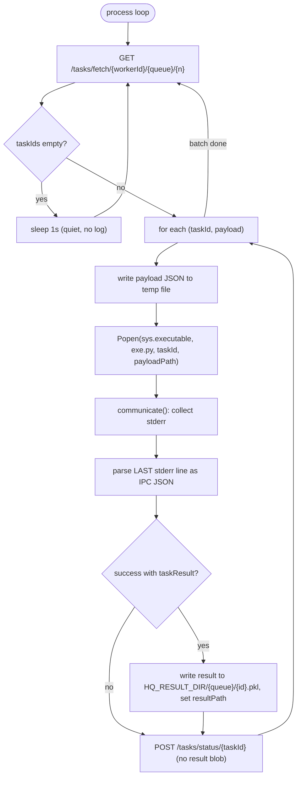

# Worker internals

How an `HQWorker` pulls work, runs it in isolation, and reports back.
Code: [`src/hq/worker/worker.py`](../../src/hq/worker/worker.py),
[`src/hq/worker/exe.py`](../../src/hq/worker/exe.py).

Much of what is documented here was hardened while bringing real
`coffea.processor.Runner` jobs onto hq — tiny smoke tasks never hit these
paths (small payloads, no library warnings on stderr).

## Worker anatomy

A worker is identified as `{hostname}-{pid}` (or an explicit `worker_id`).
`run(worker)` starts **two child processes**:

| Child | Loop |
|-------|------|
| `heartbeat` | `GET /status/{workerId}` every 1 s — the server records last-seen time |
| `process` | fetch tasks → execute each in a subprocess → report status |

Because the worker itself spawns children, the worker process **must be
non-daemon** — Python forbids daemonic processes from creating children.
Cleanup is handled with process groups instead (see Teardown below).

## The pull loop



Details that matter:

- **Emptiness is `not taskIds`**, not `len(response) == 0` — the HTTP body is
  always `{"taskIds": [], "payloads": []}` (length 2), so checking dict length
  would never look empty.
- **Idle polls are silent.** Long-lived workers (e.g. on HTCondor) poll
  forever; logging every empty fetch is spam. The worker logs only when it
  actually receives tasks.
- `fetch_n_tasks` (default 3 under `HQExecutor`) controls how many tasks one
  pull may claim. Claimed tasks run **sequentially** within one worker;
  parallelism comes from running multiple workers.

## Task execution: one subprocess per task

Each task runs in a **fresh interpreter**:

```text
<sys.executable> src/hq/worker/exe.py <taskId> /tmp/xxxx.hq-payload.json
```

Why a subprocess ([ADR 0006](../adr/0006-subprocess-per-task.md)):

- a crashing/segfaulting task cannot kill the worker loop;
- the interpreter or environment could be swapped per task
  (e.g. `uv run --with ... exe.py`, or `source setup.sh && python exe.py ...`);
- a task can be re-run by hand for debugging: `python exe.py 1 payload.json`.

Three hard-won mechanics:

### 1. Payload via temp file (ARG_MAX)

The payload used to be passed as one argv string. Linux caps total argument
size (`ARG_MAX`, often ~2 MB); a cloudpickled coffea `Runner` closure (work
function + processor + retries wrapped in nested `functools.partial`) can
exceed it, making `Popen` fail or truncate. The worker therefore writes the
payload JSON to a temp file and passes the **path**. `exe.py` still accepts
inline JSON when the argument starts with `[` (handy for manual debugging).
The temp file is deleted after the subprocess exits.

### 2. Import bootstrap

A fresh interpreter does not inherit the notebook/client `sys.path`. Two
mechanisms make sure `import hq` works in the subprocess:

- `exe.py` inserts its own `<repo>/src` (derived from `__file__`) into
  `sys.path` before importing `hq.util`;
- the worker's `Popen` env prepends `<repo>/src` to `PYTHONPATH`.

Analysis code (coffea, awkward, user modules) is **not** bootstrapped this
way — it must either be installed in the worker's environment or shipped by
value inside the pickle
([ADR 0005](../adr/0005-cloudpickle-by-value.md)).

### 3. stderr IPC contract (last line wins)

`exe.py` communicates its outcome to the parent worker over **stderr**, as a
single JSON object that must be the **last non-empty stderr line**:

```text
.../nanoaod.py:283: RuntimeWarning: Missing cross-reference index for ...   <- tolerated
.../nanoaod.py:322: RuntimeWarning: Branch Photon_mass already exists ...   <- tolerated
{"taskStatus": "success", "taskInfo": {...}, "taskResult": "..."}           <- the IPC line
```

Libraries (coffea/NanoAOD especially) print warnings to stderr; parsing the
whole stream as JSON broke as soon as real jobs ran. `_parse_exe_ipc` takes
the last non-empty line only ([ADR 0007](../adr/0007-stderr-last-line-ipc.md)).

The IPC JSON contains:

| Field | Content |
|-------|---------|
| `taskStatus` | `"success"` or `"error"` |
| `taskInfo` | `runtime` (excludes deserialization), `peakRSS`; on error also `errorType`, `errorMessage` |
| `taskResult` | base64 cloudpickle of the return value (success only) |

stdout is reserved for human-readable logs; `exe.py` never prints the result
value itself (coffea accumulators are huge).

The parent then **strips `taskResult`** before the HTTP status update: the
blob goes to `HQ_RESULT_DIR/{queue}/{taskId}.pkl` on the shared filesystem and
only the small `resultPath` key travels to the server. See
[results.md](results.md).

## Teardown (managed workers)

When `HQExecutor(manage_workers=True)` spawns local workers, each worker calls
`os.setsid()` at startup so it owns a process group containing its heartbeat
and process children. On context exit, `HQExecutor._stop_workers` sends
`killpg(SIGTERM)`, joins briefly, then `killpg(SIGKILL)` — the whole worker
tree dies promptly. Plain `terminate()` on the parent was not enough: orphaned
process loops kept polling the queue after the client finished.

With `manage_workers=False` (HTCondor or other externally managed workers)
none of this applies: workers keep pulling forever and the client never owns
their lifecycle. This is local process hygiene, not a central scheduler —
the pull-queue philosophy is unchanged.

## Related

- [Task lifecycle](task-lifecycle.md) — states and fault recovery
- [Results](results.md) — where `taskResult` ends up
- [ADR 0006](../adr/0006-subprocess-per-task.md), [ADR 0007](../adr/0007-stderr-last-line-ipc.md), [ADR 0008](../adr/0008-managed-worker-teardown.md)
- [Troubleshooting](../ops/troubleshooting.md)
